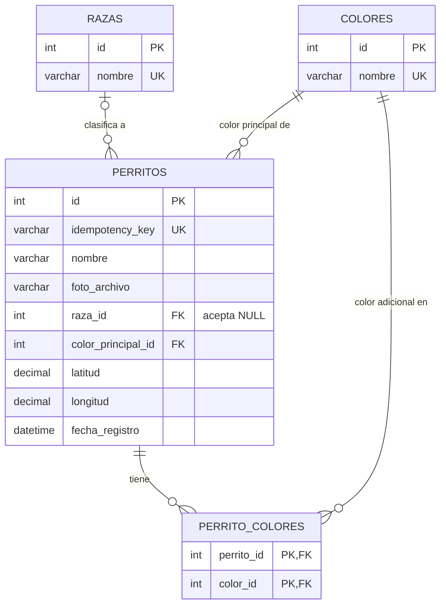

# Registro de perritos de la calle

Aplicación web para registrar perritos de la calle: quien encuentra uno le toma una foto, le pone un nombre, anota cómo es (raza y hasta 3 colores) y marca en un mapa dónde lo vio. El registro sirve para que rescatistas, vecinos y asociaciones sepan qué perros hay, cómo identificarlos y en qué zona andan. Está pensada para usarse desde un celular en la calle.

**Materia:** Programación lógica y funcional · **Profesor:** Daniel Varela · **Proyecto 1**

## Contenido

1. [Integrantes y roles](#1-integrantes-y-roles)
2. [Requisitos previos](#2-requisitos-previos)
3. [Instalación](#3-instalación)
4. [Base de datos](#4-base-de-datos)
5. [Configuración](#5-configuración)
6. [Cómo ejecutar](#6-cómo-ejecutar)
7. [Probar desde un celular](#7-probar-desde-un-celular)
8. [Endpoints de la API](#8-endpoints-de-la-api)
9. [Capturas de pantalla](#9-capturas-de-pantalla)
10. [Problemas comunes](#10-problemas-comunes)
11. [Paradigmas e idempotencia](#11-paradigmas-e-idempotencia)
12. [Despliegue (punto extra)](#12-despliegue-punto-extra)

---

## 1. Integrantes y roles

| Integrante | Usuario de GitHub | Rol |
|---|---|---|
| <<COMPLETAR: Estrella Luna Vazquez>> | Memo8aaaa |<< DBA>> |
| <<Johana Emireth Cerda Flores>> | Emireth555 | << Frontend>> |
| <<Estrella Luna Vazquez y Johana Emireth Cerda Flores>> | <<Memo8aaaa Emireth555 >> | << Backend>> |

### Estructura del repositorio

```
perritos_proyecto1/
├── README.md
├── backend/                  API en Node.js + Express
│   ├── server.js             arranque, monta las rutas y sirve el frontend
│   ├── db.js                 pool de conexiones a MySQL
│   ├── .env.example          variables de configuración de ejemplo
│   ├── middleware/
│   │   └── upload.js         valida (magic bytes) y guarda las fotos
│   ├── routes/
│   │   ├── perritos.js       registro idempotente, lista, detalle, estadísticas
│   │   ├── catalogos.js      razas y colores
│   │   └── imagenes.js       entrega las fotos por un endpoint
│   └── tests/
│       └── doble-envio.js    prueba de idempotencia
├── frontend/                 HTML, CSS y JavaScript (mapa con Leaflet)
    |──assets
│   ├── index.html
│   ├── app.js
│   └── styles.css
├── database/                 rol DBA
│   ├── schema.sql            crea la base y las tablas
│   ├── catalogos.sql         razas y colores
│   ├── datos_prueba.sql      15 perritos de prueba
│   ├── usuario_app.sql       usuario de MySQL para el backend
│   ├── consultas_ejemplo.sql consultas con JOIN y agregación
│   └── imagenes_prueba/      15 fotos livianas de prueba
└── docs/
                capturas de pantalla para este README
```

---

## 2. Requisitos previos

Probado en Windows 10/11 con PowerShell.

| Componente | Versión | Cómo verificarla |
|---|---|---|
| Git | 2.55.0.windows.5 | `git --version` |
| Node.js | v24.21.0 | `node --version` |
| npm | 11.19.0 | `npm --version` |
| MySQL Server (Community) | 8.0.46 (mínimo 8.0.16, por el `CHECK` del esquema) | `mysql --version` |
| Navegador | Microsoft Edge o Google Chrome actualizados | |

Dependencias del backend (se instalan solas con `npm install`; sus versiones quedan en `backend/package.json`):

| Paquete | Versión |
|---|---|
| express | 4.22.3 |
| cors | 2.8.6 |
| dotenv | 16.6.1 |
| mysql2 | 3.24.4 |
| multer | 2.4.0 |

Librería del frontend: Leaflet 1.9.4 (se carga desde internet, hace falta conexión).

> Para llenar las versiones: en la carpeta `backend/`, `npm list --depth=0` muestra todas.

---

## 3. Instalación

Todos los comandos son para **PowerShell**. No se usa Docker.

**3.1 Instala los programas** (si no los tienes):

- Git: https://git-scm.com/download/win
- Node.js (versión LTS): https://nodejs.org
- MySQL Server: https://dev.mysql.com/downloads/installer/ (elige *Server only*, deja el puerto `3306`, define una contraseña para `root` y anótala; deja marcado que inicie con Windows).

Cierra y vuelve a abrir PowerShell, y comprueba:

```powershell
git --version
node --version
mysql --version
```

Si `mysql` no se reconoce, ver [Problemas comunes](#10-problemas-comunes).

**3.2 Clona el repositorio:**

```powershell
git clone https://github.com/Emireth555/perritos_proyecto1.git
cd perritos_proyecto1
```

**3.3 Instala las dependencias del backend:**

```powershell
cd backend
npm install
cd ..
```

Sigue con la base de datos (sección 4), la configuración (sección 5) y la ejecución (sección 6). Todos los comandos siguientes se corren **desde la carpeta raíz del repositorio**, salvo los que indican `cd backend`.

---

## 4. Base de datos

Motor: **MySQL 8.0**. Base: `perritos_db`. Codificación: `utf8mb4` (para que los acentos se guarden bien).

### 4.1 Crear la base, los catálogos y los datos de prueba

Corre los tres comandos **en este orden**; cada uno pide la contraseña de `root`:

```powershell
mysql -u root -p --default-character-set=utf8mb4 -e "source database/schema.sql"
mysql -u root -p --default-character-set=utf8mb4 -e "source database/catalogos.sql"
mysql -u root -p --default-character-set=utf8mb4 -e "source database/datos_prueba.sql"
```

- `schema.sql` crea la base y las 4 tablas. **Borra y recrea las tablas** si ya existían, así que volver a correrlo elimina los perritos registrados; hay que recargar catálogos y datos de prueba después.
- `catalogos.sql` carga 12 razas (incluye *Sin raza definida / criollo*) y 12 colores.
- `datos_prueba.sql` carga 15 perritos con su foto, ubicación (zona de Saltillo, Coahuila) y colores adicionales.

### 4.2 Crear el usuario de MySQL para la aplicación

El backend **no usa `root`**: usa un usuario propio que solo puede leer y escribir en `perritos_db`.

1. Abre `database/usuario_app.sql` con el Bloc de notas o VS Code.
2. Sustituye el texto `CAMBIA_ESTA_CONTRASENA` (todas las veces que aparezca) por una contraseña tuya. Usa letras, números y guion bajo; evita `$`, `` ` ``, `"` y `%`. **Anótala**: irá en el `.env`.
3. Corre:

```powershell
mysql -u root -p -e "source database/usuario_app.sql"
```

### 4.3 Verificar

```powershell
mysql -u root -p -e "SELECT COUNT(*) AS razas FROM perritos_db.razas; SELECT COUNT(*) AS colores FROM perritos_db.colores; SELECT COUNT(*) AS perritos FROM perritos_db.perritos;"
mysql -u perritos_app -p -e "SHOW GRANTS;"
```

Debe mostrar 12 razas, 12 colores y 15 perritos, y en la segunda (con la contraseña del paso 4.2) un `GRANT SELECT, INSERT, UPDATE, DELETE ON perritos_db.*`.

### 4.4 Fotos de prueba

La base guarda solo el **nombre** de cada foto (`foto_archivo`). Las imágenes viven en una carpeta **fuera del repositorio** (variable `RUTA_IMAGENES`, sección 5). Las 15 fotos de prueba (livianas, menos de 130 KB cada una) están en `database/imagenes_prueba/`; hay que copiarlas a esa carpeta:

```powershell
New-Item -ItemType Directory -Force $HOME\perritos-imagenes
Copy-Item database\imagenes_prueba\*.jpg $HOME\perritos-imagenes\ -Force
```

### 4.5 Diagrama entidad-relación



- Un perrito tiene **una raza o ninguna** (`raza_id` acepta `NULL`; además el catálogo trae la opción explícita *Sin raza definida / criollo*) y **exactamente un color principal**.
- Los **0 a 2 colores adicionales** van en `perrito_colores`, tabla intermedia de la relación muchos a muchos entre perritos y colores. Su llave primaria compuesta `(perrito_id, color_id)` impide repetir un color en el mismo perrito.

### 4.6 Reglas que garantiza la base de datos

| Regla | Cómo se garantiza |
|---|---|
| No se duplica un registro enviado dos veces | `UNIQUE` en `perritos.idempotency_key` |
| El nombre no puede estar vacío ni ser solo espacios | `CHECK (TRIM(nombre) <> '')` |
| Raza y colores deben existir en los catálogos | Llaves foráneas |
| Si se borra un perrito, se borran sus colores adicionales | `ON DELETE CASCADE` en `perrito_colores` |
| No se puede borrar un color que esté en uso | `ON DELETE RESTRICT` |
| Máximo 2 colores adicionales y ninguno igual al principal | Trigger `trg_perrito_colores_bi` (segunda línea de defensa; el backend también lo valida) |

### 4.7 Consultas declarativas (JOIN y agregación)

`database/consultas_ejemplo.sql` reúne las consultas de referencia: detalle de cada perrito con raza, color principal y colores adicionales (JOIN); perritos por color y por zona (agregación con `GROUP BY`); y una verificación de que no hay claves de idempotencia repetidas. Para correrlas:

```powershell
mysql -u root -p -e "source database/consultas_ejemplo.sql"
```

### 4.8 Respaldo y restauración

**Respaldar la base** (usa `--result-file` en lugar de `>`, porque PowerShell 5.1 guarda las redirecciones en UTF-16 y el respaldo quedaría inservible):

```powershell
mysqldump -u root -p --routines --triggers --single-transaction --default-character-set=utf8mb4 --result-file=respaldo_perritos_db.sql perritos_db
```

**Respaldar las imágenes:**

```powershell
Compress-Archive -Path $HOME\perritos-imagenes\* -DestinationPath respaldo_imagenes.zip -Force
```

**Restaurar la base:**

```powershell
mysql -u root -p -e "CREATE DATABASE IF NOT EXISTS perritos_db CHARACTER SET utf8mb4 COLLATE utf8mb4_unicode_ci"
mysql -u root -p --default-character-set=utf8mb4 perritos_db -e "source respaldo_perritos_db.sql"
```

**Restaurar las imágenes:**

```powershell
Expand-Archive respaldo_imagenes.zip -DestinationPath $HOME\perritos-imagenes -Force
```

Guarda los respaldos **fuera del repositorio**. El respaldo de la base no incluye al usuario `perritos_app`; si se restaura en otra máquina, se vuelve a crear con el paso 4.2.

---

## 5. Configuración

El backend lee su configuración de `backend/.env`, que **no se sube a Git** (contiene contraseñas). Se crea a partir del ejemplo:

```powershell
Copy-Item backend\.env.example backend\.env
notepad backend\.env
```

| Variable | Qué es | Ejemplo |
|---|---|---|
| `PORT` | Puerto donde corre el servidor | `3000` |
| `DB_HOST` | Servidor de MySQL | `localhost` |
| `DB_PORT` | Puerto de MySQL | `3306` |
| `DB_USER` | Usuario de MySQL (el del paso 4.2) | `perritos_app` |
| `DB_PASSWORD` | Contraseña de ese usuario | `la_que_elegiste` |
| `DB_NAME` | Nombre de la base | `perritos_db` |
| `RUTA_IMAGENES` | Carpeta **fuera del proyecto** donde se guardan las fotos | `C:/Users/TU_USUARIO/perritos-imagenes` |

Para `RUTA_IMAGENES` usa barras `/` (no `\`). Este comando imprime la ruta ya lista para pegar:

```powershell
($HOME -replace '\\','/') + '/perritos-imagenes'
```

Si la carpeta no existe, el backend la crea al arrancar. Sin la variable `RUTA_IMAGENES` el servidor no arranca.

---

## 6. Cómo ejecutar

El servidor de Express sirve la API **y** el frontend, así que hay un solo proceso y una sola dirección:

```powershell
cd backend
node server.js
```

Debe imprimir `Servidor corriendo en http://localhost:3000`.

| Parte | URL |
|---|---|
| Frontend (la aplicación) | http://localhost:3000 |
| Backend (API) | http://localhost:3000/api |

Para detenerlo: `Ctrl + C`. Hay que correr `node server.js` **desde la carpeta `backend/`**, porque ahí se busca el archivo `.env`.

---

## 7. Probar desde un celular

La aplicación se usa desde el celular, y el navegador solo da acceso a la **ubicación** (y a funciones como `crypto.randomUUID`) en `https` o `localhost`. Hay dos formas de probarla:

### 7.1 En la misma red Wi-Fi (sin HTTPS)

1. Con el servidor corriendo, obtén la IP de la laptop: `ipconfig` y copia la *Dirección IPv4* del adaptador Wi-Fi (por ejemplo `192.168.1.50`).
2. Conecta el celular **a la misma red Wi-Fi**.
3. En el navegador del celular abre `http://TU_IP:3000`.
4. Si Windows pregunta por el firewall, permite el acceso en **redes privadas**.

Por http la carga de la lista y el mapa, elegir una foto y mover el pin a mano funcionan; el botón de ubicación actual puede fallar. Algunas redes (escuelas, cafés) aíslan a los dispositivos entre sí: si no carga, usa el hotspot del celular (conecta la laptop a él y repite desde el paso 1).

### 7.2 Con HTTPS (cámara y ubicación completas)

Un túnel de Cloudflare da una dirección `https` pública, sin cuenta y sin configurar nada:

```powershell
winget install --id Cloudflare.cloudflared
```

Cierra y abre PowerShell. Con el servidor corriendo en otra ventana:

```powershell
cloudflared tunnel --url http://localhost:3000
```

Imprime una dirección `https://algo.trycloudflare.com`; ábrela en el celular (funciona incluso con datos móviles). La dirección **cambia cada vez** y deja de funcionar al cerrar esa ventana. Mientras el túnel está abierto, la aplicación es accesible públicamente; ciérralo con `Ctrl + C` al terminar. La base de datos nunca se expone: solo el puerto 3000 pasa por el túnel.

---

## 8. Endpoints de la API

Todos los errores responden JSON con un mensaje legible: `{ "error": "Falta la foto" }`.

| Método | Ruta | Qué hace |
|---|---|---|
| `POST` | `/api/perritos` | Registra un perrito (idempotente) |
| `GET` | `/api/perritos` | Lista de perritos, del más reciente al más antiguo |
| `GET` | `/api/perritos/:id` | Detalle de un perrito, con sus colores adicionales |
| `GET` | `/api/perritos/estadisticas/por-color` | Cuántos perritos hay por color principal |
| `GET` | `/api/imagenes/:archivo` | Entrega una foto guardada |
| `GET` | `/api/razas` | Catálogo de razas |
| `GET` | `/api/colores` | Catálogo de colores |

### `POST /api/perritos`

Se envía como `multipart/form-data`:

| Campo | Obligatorio | Regla |
|---|---|---|
| `foto` | Sí | Archivo JPG, PNG o WEBP, máximo 8 MB. Se valida por su contenido real, no por la extensión |
| `idempotency_key` | Sí | Clave única del envío (ver sección 11) |
| `nombre` | Sí | Texto no vacío; solo espacios no cuenta |
| `raza_id` | No | Id del catálogo de razas |
| `color_principal_id` | Sí | Id del catálogo de colores |
| `colores_adicionales` | No | Texto JSON con una lista de ids, por ejemplo `"[2,3]"`. Máximo 2, sin repetir y sin incluir el color principal |
| `latitud`, `longitud` | Sí | Ubicación del perrito |

La fecha de registro la pone el servidor.

**Respuestas:** `201` si creó el registro; `200` con **el mismo registro** si esa clave ya se había enviado; `400` si falta algo o algo es inválido (`Falta la foto`, `Falta el nombre`, `Falta el color principal`, `Falta la ubicación`, `Máximo 2 colores adicionales`, `Un color no puede repetirse`, `El archivo no es una imagen válida`, entre otros); `500` si algo falla en el servidor.

Ejemplo de respuesta:

```json
{
  "id": 16,
  "nombre": "Manchas",
  "foto_archivo": "3f2b1c9e-....jpg",
  "latitud": "25.4260000",
  "longitud": "-100.9959000",
  "fecha_registro": "2026-09-28T18:30:00.000Z",
  "raza": "Sin raza definida / criollo",
  "color_principal": "Café",
  "colores_adicionales": ["Blanco"]
}
```

`GET /api/perritos` devuelve una lista con los mismos campos, sin `colores_adicionales` (esos se piden en el detalle `GET /api/perritos/:id`).

### Fotos

Las fotos **no se sirven como carpeta pública**: todas pasan por `GET /api/imagenes/:archivo`, que solo entrega archivos que estén dentro de `RUTA_IMAGENES`. El nombre de cada archivo lo genera el servidor (un UUID más la extensión detectada en el contenido); nunca se usa el nombre que mandó el usuario.

---

## 9. Capturas de pantalla

Formulario de registro:


Mapa con un pin por perrito:


Lista con foto en miniatura:


Detalle de un registro:


Validación: el formulario rechaza un registro incompleto con un mensaje entendible:


Funcionando desde un celular:


Prueba del doble envío:


---

## 10. Problemas comunes

| Problema | Causa | Solución |
|---|---|---|
| `'mysql' no se reconoce como un comando` | MySQL no está en el `PATH` | Agrega `C:\Program Files\MySQL\MySQL Server 8.0\bin` a la variable `Path` (Variables de entorno de Windows) y abre PowerShell de nuevo |
| El servidor dice `Falta configurar RUTA_IMAGENES en el .env` | No existe `backend/.env`, o se corrió `node server.js` fuera de `backend/` | Crea el `.env` (sección 5) y corre el servidor desde `backend/` |
| `Access denied for user 'perritos_app'` | La contraseña del `.env` no es la del paso 4.2 | Comprueba con `mysql -u perritos_app -p -e "SHOW GRANTS;"`. Si falla, con `root`: `ALTER USER 'perritos_app'@'localhost' IDENTIFIED BY 'nueva';` y pon la misma en el `.env` |
| Al escribir la contraseña no se ve nada | Es normal en la terminal | Escríbela igual y presiona Enter |
| El operador `<` da error en PowerShell | PowerShell no lo admite | Usa los comandos con `-e "source archivo.sql"` de esta guía |
| Los acentos salen mal (`Simón`) | Se cargó sin `utf8mb4` | Vuelve a correr los tres scripts con `--default-character-set=utf8mb4` (paso 4.1) |
| Las fotos de la lista no se ven | Las fotos de prueba no están en `RUTA_IMAGENES` o la ruta está mal | Repite el paso 4.4 y revisa la ruta del `.env` |
| Error 1419 al crear el trigger | Se corrió `schema.sql` con un usuario que no es `root` | Córrelo con `root` |
| `EADDRINUSE` al arrancar | El puerto 3000 ya está en uso | Cierra el otro servidor o cambia `PORT` en el `.env` |
| El celular no carga la página | Otra red, firewall o red que aísla dispositivos | Misma red Wi-Fi, permitir redes privadas en el firewall, o usar el hotspot del celular (sección 7.1) |
| En el celular falla la ubicación o la cámara | El navegador las bloquea sin `https` | Usa el túnel HTTPS (sección 7.2) |
| `mysql: [Warning] Using a password on the command line` | Aviso al poner la contraseña en el comando | Es informativo, no es un error |

---

## 11. Paradigmas e idempotencia

### Dónde se usa cada paradigma

| Paradigma | Dónde está el código | Por qué conviene ahí |
|---|---|---|
| **Declarativo** | Consultas SQL en `backend/routes/perritos.js` (`GET /api/perritos`, `obtenerPerritoCompleto`, `/estadisticas/por-color`) y `backend/routes/catalogos.js`; `database/schema.sql` (llaves, `UNIQUE`, `CHECK`, trigger) y `database/consultas_ejemplo.sql`; `frontend/index.html` y `frontend/styles.css` | Filtrar, unir, ordenar y agrupar le toca al manejador de base de datos: se describe *qué* datos se quieren, no cómo recorrerlos. Nunca se traen todos los registros para filtrarlos con un ciclo. HTML y CSS también son declarativos: describen qué debe verse, no cómo dibujarlo |
| **Imperativo** | `POST /api/perritos` en `backend/routes/perritos.js`; `validarYGuardarImagen` en `backend/middleware/upload.js`; `backend/server.js` | El registro es una secuencia con efectos que importan en orden: validar, revisar la clave, abrir transacción, guardar en disco y en la base, confirmar o deshacer, responder |
| **Funcional** | `coloresExtra.map(...)` y el spread en `obtenerPerritoCompleto` (`backend/routes/perritos.js`); `firma.every(...)` en `backend/middleware/upload.js` | Son transformaciones de datos sin efectos secundarios: reciben una lista y devuelven otra |
| **Orientado a objetos** | Uso de objetos de librerías: el pool y la conexión de `mysql2` (`getConnection`, `beginTransaction`, `commit`, `release`), `express.Router`, la instancia de `multer`, y los objetos de mapa y marcadores de Leaflet en el frontend | No definimos clases propias: JavaScript entrega estas librerías como objetos que guardan su estado y exponen métodos. Para el tamaño del proyecto no hacía falta modelar clases propias |

### Transformación funcional señalada

En `backend/routes/perritos.js`, al guardar los colores adicionales:

```javascript
const valores = coloresExtra.map((colorId) => [perritoId, colorId]);
```

Convierte la lista de ids en la lista de pares `[perrito, color]` que necesita el `INSERT`, **sin ciclos explícitos y sin modificar** `coloresExtra`. Igualmente, `obtenerPerritoCompleto` arma la respuesta con `{ ...perrito, colores_adicionales: coloresExtra.map((c) => c.nombre) }`: crea un objeto nuevo en lugar de modificar el original.

### Idempotencia del registro

**Problema:** el usuario presiona *Enviar* dos veces, o el celular reintenta por mala señal, y quedarían dos perritos idénticos.

**Clave elegida:** una clave **generada al abrir el formulario** (un UUID, en `frontend/app.js`, función `generarClave()`), que viaja en el campo `idempotency_key` y cambia solo cuando se hace un registro nuevo. `generarClave()` usa `crypto.randomUUID()` cuando el navegador lo permite (en `https` o `localhost`), y si no existe (por ejemplo al probar por `http://192.168.x.x` en la red local), arma el UUID a mano con `crypto.getRandomValues()`, que sí funciona en http. Se descartó una clave natural (nombre + ubicación) porque dos perritos distintos pueden compartir nombre o zona y el segundo quedaría bloqueado por error.

**Cómo se resuelve en el backend** (`POST /api/perritos`):

1. Antes de guardar, busca la clave: `SELECT id FROM perritos WHERE idempotency_key = ?`.
2. Si **ya existe**, no crea nada: descarta la foto de este envío repetido y responde `200` con el **mismo registro y el mismo id**. No se responde "error: duplicado".
3. Si no existe, guarda el perrito y sus colores dentro de una **transacción** y responde `201`.
4. Si dos envíos idénticos llegan **al mismo tiempo**, ambos pasan el paso 1, pero la restricción `UNIQUE` de `perritos.idempotency_key` deja entrar solo a uno. Al otro se le responde con el registro ya guardado (mismo id), no con un error.

Así la propia base de datos garantiza que nunca existan dos registros con la misma clave.

### Prueba del doble envío

Con el servidor corriendo en otra ventana:

```powershell
cd backend
node tests/doble-envio.js
```

Manda dos veces el mismo registro, con la misma clave y la misma foto, y verifica cinco cosas: que el primero devuelva `201`, que el segundo devuelva `200` (no un error), que ambos den el mismo id, que se conserve el registro original y que el total de perritos suba en 1, no en 2. Salida esperada (los números pueden variar):

```
1er envío -> HTTP 201, id 16
2do envío -> HTTP 200, id 16
Total de perritos: 15 -> 16

PASA  El primer envío crea el registro (201)
PASA  El segundo envío responde 200, no error de duplicado
PASA  Ambos envíos devuelven el mismo id
PASA  Se conserva el registro original (nombre, foto y fecha iguales)
PASA  No se creó un perrito nuevo (el total subió en 1, no en 2)

RESULTADO: el guardado es idempotente.
```

Cada corrida deja un perrito llamado "PRUEBA doble envio"; se puede borrar con `DELETE FROM perritos WHERE nombre = 'PRUEBA doble envio';`.

Para comprobar a mano: presiona dos veces seguidas el botón de registrar y luego corre en MySQL la última consulta de `database/consultas_ejemplo.sql`; debe devolver **0 filas**.

---

## 12. Despliegue (punto extra)

### 12.1 Cómo lo tienen ahora mismo (para la demo)

La aplicación corre en la laptop de un integrante, expuesta a internet con un
**túnel de Cloudflare** (`cloudflared tunnel --url http://localhost:3000`). Solo
el puerto 3000 sale a internet; MySQL (3306) nunca se expone, porque el túnel
solo redirige el puerto que se le indica. El certificado HTTPS lo gestiona
Cloudflare automáticamente sobre un subdominio temporal de `trycloudflare.com`
(no se paga ni se configura dominio propio). La URL cambia cada vez que se
reinicia el túnel y deja de existir si se cierra la ventana o se apaga la
laptop:

**URL de la demo:** `<<PEGAR AQUÍ LA URL DEL DÍA DE LA PRESENTACIÓN>>`

### 12.2 Dónde correría cada pieza en un despliegue real

| Pieza | Dónde correría |
|---|---|
| Aplicación (Node + Express) | Una VM o VPS (ej. un droplet de DigitalOcean, una instancia de AWS Lightsail) |
| Base de datos (MySQL) | El mismo servidor o uno aparte, **nunca accesible desde internet** |
| Carpeta de imágenes (`RUTA_IMAGENES`) | Un disco/directorio del servidor fuera de la carpeta del proyecto — o un bucket de almacenamiento de objetos (ej. S3), si se quisiera escalar más |

### 12.3 Dominio y certificado HTTPS

Se compraría un dominio (ej. en Namecheap o Google Domains) y se apuntaría con
un registro **A** a la IP del servidor. El certificado se obtendría gratis con
**Let's Encrypt**, usando `certbot`, que se renueva solo cada 90 días. Sin
HTTPS el navegador no da acceso a la cámara ni a la ubicación, así que este
paso no es opcional para que la app funcione como se pide.

### 12.4 Qué cambia entre local y producción

| Variable | Local | Producción |
|---|---|---|
| `DB_HOST` | `localhost` | Host interno del servidor de base de datos |
| `DB_USER` / `DB_PASSWORD` | `perritos_app` con contraseña de prueba | Usuario y contraseña distintos, generados solo para producción |
| `RUTA_IMAGENES` | Carpeta en la laptop (`C:/Users/.../perritos-imagenes`) | Directorio del servidor fuera del proyecto, ej. `/var/data/perritos-imagenes` |
| `PORT` | `3000`, se accede directo | `3000` puertas adentro; el proxy inverso lo expone por el 443 (https) |

Las contraseñas de producción **nunca se suben al repositorio**: vivirían en
el `.env` del servidor (el mismo que ya está en `.gitignore`) o en un gestor
de secretos si el hospedaje lo ofrece.

### 12.5 Puertos abiertos

| Puerto | ¿Abierto a internet? |
|---|---|
| 443 (https, por el proxy inverso) | Sí |
| 80 (http, solo para redirigir a https) | Sí |
| 3000 (Node/Express) | No — solo accesible desde el propio servidor, a través del proxy |
| 3306 (MySQL) | No, nunca |

### 12.6 Respaldo y restauración en producción

Los comandos son los mismos que ya se documentaron en la sección 4.8
(`mysqldump` para la base, `Compress-Archive`/`tar` para las imágenes), pero
en el servidor se automatizarían con una tarea programada (cron) que los
corra a diario y guarde el resultado fuera del propio servidor (ej. en
almacenamiento de objetos o descargado periódicamente), para no perder todo
si el servidor falla.

### 12.7 Cómo quedaría corriendo sin Docker

Como el proyecto no usa Docker, el servicio de Node se instalaría directo en
el sistema operativo del servidor (Linux, típicamente) y quedaría
administrado por **systemd**, para que si el proceso truena o el servidor se
reinicia, arranque solo:

```ini
# /etc/systemd/system/perritos.service
[Unit]
Description=API de perritos de la calle
After=network.target mysql.service

[Service]
WorkingDirectory=/var/www/perritos/backend
ExecStart=/usr/bin/node server.js
Restart=always
EnvironmentFile=/var/www/perritos/backend/.env
User=perritos

[Install]
WantedBy=multi-user.target
```

Al frente iría **nginx** (o Caddy) como proxy inverso: recibe las peticiones
en el puerto 443 con el certificado HTTPS, y las reenvía a Node en el puerto
3000, que sigue sin ser accesible directamente desde fuera.# Registro de perritos de la calle

Aplicación web para registrar perritos de la calle: quien encuentra uno le toma una foto, le pone un nombre, anota cómo es (raza y hasta 3 colores) y marca en un mapa dónde lo vio. El registro sirve para que rescatistas, vecinos y asociaciones sepan qué perros hay, cómo identificarlos y en qué zona andan. Está pensada para usarse desde un celular en la calle.

**Materia:** Programación lógica y funcional · **Profesor:** Daniel Varela · **Proyecto 1**

## Contenido

1. [Integrantes y roles](#1-integrantes-y-roles)
2. [Requisitos previos](#2-requisitos-previos)
3. [Instalación](#3-instalación)
4. [Base de datos](#4-base-de-datos)
5. [Configuración](#5-configuración)
6. [Cómo ejecutar](#6-cómo-ejecutar)
7. [Probar desde un celular](#7-probar-desde-un-celular)
8. [Endpoints de la API](#8-endpoints-de-la-api)
9. [Capturas de pantalla](#9-capturas-de-pantalla)
10. [Problemas comunes](#10-problemas-comunes)
11. [Paradigmas e idempotencia](#11-paradigmas-e-idempotencia)
12. [Despliegue (punto extra)](#12-despliegue-punto-extra)

---

## 1. Integrantes y roles

| Integrante | Usuario de GitHub | Rol |
|---|---|---|
| <<COMPLETAR: nombre completo>> | Memo8aaaa | **DBA**: modelo de datos, script de creación de la base, catálogos, datos de prueba, respaldo |
| <<COMPLETAR: nombre completo>> | Emireth555 | <<CONFIRMAR: Frontend / Backend>> |
| <<COMPLETAR: nombre completo>> | <<COMPLETAR: usuario>> | <<CONFIRMAR: Frontend / Backend>> |

### Estructura del repositorio

```
perritos_proyecto1/
├── README.md
├── backend/                  API en Node.js + Express
│   ├── server.js             arranque, monta las rutas y sirve el frontend
│   ├── db.js                 pool de conexiones a MySQL
│   ├── .env.example          variables de configuración de ejemplo
│   ├── middleware/
│   │   └── upload.js         valida (magic bytes) y guarda las fotos
│   ├── routes/
│   │   ├── perritos.js       registro idempotente, lista, detalle, estadísticas
│   │   ├── catalogos.js      razas y colores
│   │   └── imagenes.js       entrega las fotos por un endpoint
│   └── tests/
│       └── doble-envio.js    prueba de idempotencia
├── frontend/                 HTML, CSS y JavaScript (mapa con Leaflet)
│   ├── index.html
│   ├── app.js
│   └── styles.css
├── database/                 rol DBA
│   ├── schema.sql            crea la base y las tablas
│   ├── catalogos.sql         razas y colores
│   ├── datos_prueba.sql      15 perritos de prueba
│   ├── usuario_app.sql       usuario de MySQL para el backend
│   ├── consultas_ejemplo.sql consultas con JOIN y agregación
│   └── imagenes_prueba/      15 fotos livianas de prueba
└── docs/
    └── capturas/             capturas de pantalla para este README
```

---

## 2. Requisitos previos

Probado en Windows 10/11 con PowerShell.

| Componente | Versión | Cómo verificarla |
|---|---|---|
| Git | <<COMPLETAR: salida de `git --version`>> | `git --version` |
| Node.js | v24.21.0 | `node --version` |
| npm | 11.19.0 | `npm --version` |
| MySQL Server (Community) | 8.0.46 (mínimo 8.0.16, por el `CHECK` del esquema) | `mysql --version` |
| Navegador | Microsoft Edge o Google Chrome actualizados | |

Dependencias del backend (se instalan solas con `npm install`; sus versiones quedan en `backend/package.json`):

| Paquete | Versión |
|---|---|
| express | <<COMPLETAR>> |
| cors | <<COMPLETAR>> |
| dotenv | <<COMPLETAR>> |
| mysql2 | <<COMPLETAR>> |
| multer | 2.4.0 |

Librería del frontend: Leaflet 1.9.4 (se carga desde internet, hace falta conexión).

> Para llenar las versiones: en la carpeta `backend/`, `npm list --depth=0` muestra todas.

---

## 3. Instalación

Todos los comandos son para **PowerShell**. No se usa Docker.

**3.1 Instala los programas** (si no los tienes):

- Git: https://git-scm.com/download/win
- Node.js (versión LTS): https://nodejs.org
- MySQL Server: https://dev.mysql.com/downloads/installer/ (elige *Server only*, deja el puerto `3306`, define una contraseña para `root` y anótala; deja marcado que inicie con Windows).

Cierra y vuelve a abrir PowerShell, y comprueba:

```powershell
git --version
node --version
mysql --version
```

Si `mysql` no se reconoce, ver [Problemas comunes](#10-problemas-comunes).

**3.2 Clona el repositorio:**

```powershell
git clone https://github.com/Emireth555/perritos_proyecto1.git
cd perritos_proyecto1
```

**3.3 Instala las dependencias del backend:**

```powershell
cd backend
npm install
cd ..
```

Sigue con la base de datos (sección 4), la configuración (sección 5) y la ejecución (sección 6). Todos los comandos siguientes se corren **desde la carpeta raíz del repositorio**, salvo los que indican `cd backend`.

---

## 4. Base de datos

Motor: **MySQL 8.0**. Base: `perritos_db`. Codificación: `utf8mb4` (para que los acentos se guarden bien).

### 4.1 Crear la base, los catálogos y los datos de prueba

Corre los tres comandos **en este orden**; cada uno pide la contraseña de `root`:

```powershell
mysql -u root -p --default-character-set=utf8mb4 -e "source database/schema.sql"
mysql -u root -p --default-character-set=utf8mb4 -e "source database/catalogos.sql"
mysql -u root -p --default-character-set=utf8mb4 -e "source database/datos_prueba.sql"
```

- `schema.sql` crea la base y las 4 tablas. **Borra y recrea las tablas** si ya existían, así que volver a correrlo elimina los perritos registrados; hay que recargar catálogos y datos de prueba después.
- `catalogos.sql` carga 12 razas (incluye *Sin raza definida / criollo*) y 12 colores.
- `datos_prueba.sql` carga 15 perritos con su foto, ubicación (zona de Saltillo, Coahuila) y colores adicionales.

### 4.2 Crear el usuario de MySQL para la aplicación

El backend **no usa `root`**: usa un usuario propio que solo puede leer y escribir en `perritos_db`.

1. Abre `database/usuario_app.sql` con el Bloc de notas o VS Code.
2. Sustituye el texto `CAMBIA_ESTA_CONTRASENA` (todas las veces que aparezca) por una contraseña tuya. Usa letras, números y guion bajo; evita `$`, `` ` ``, `"` y `%`. **Anótala**: irá en el `.env`.
3. Corre:

```powershell
mysql -u root -p -e "source database/usuario_app.sql"
```

### 4.3 Verificar

```powershell
mysql -u root -p -e "SELECT COUNT(*) AS razas FROM perritos_db.razas; SELECT COUNT(*) AS colores FROM perritos_db.colores; SELECT COUNT(*) AS perritos FROM perritos_db.perritos;"
mysql -u perritos_app -p -e "SHOW GRANTS;"
```

Debe mostrar 12 razas, 12 colores y 15 perritos, y en la segunda (con la contraseña del paso 4.2) un `GRANT SELECT, INSERT, UPDATE, DELETE ON perritos_db.*`.

### 4.4 Fotos de prueba

La base guarda solo el **nombre** de cada foto (`foto_archivo`). Las imágenes viven en una carpeta **fuera del repositorio** (variable `RUTA_IMAGENES`, sección 5). Las 15 fotos de prueba (livianas, menos de 130 KB cada una) están en `database/imagenes_prueba/`; hay que copiarlas a esa carpeta:

```powershell
New-Item -ItemType Directory -Force $HOME\perritos-imagenes
Copy-Item database\imagenes_prueba\*.jpg $HOME\perritos-imagenes\ -Force
```

### 4.5 Diagrama entidad-relación


- Un perrito tiene **una raza o ninguna** (`raza_id` acepta `NULL`; además el catálogo trae la opción explícita *Sin raza definida / criollo*) y **exactamente un color principal**.
- Los **0 a 2 colores adicionales** van en `perrito_colores`, tabla intermedia de la relación muchos a muchos entre perritos y colores. Su llave primaria compuesta `(perrito_id, color_id)` impide repetir un color en el mismo perrito.

### 4.6 Reglas que garantiza la base de datos

| Regla | Cómo se garantiza |
|---|---|
| No se duplica un registro enviado dos veces | `UNIQUE` en `perritos.idempotency_key` |
| El nombre no puede estar vacío ni ser solo espacios | `CHECK (TRIM(nombre) <> '')` |
| Raza y colores deben existir en los catálogos | Llaves foráneas |
| Si se borra un perrito, se borran sus colores adicionales | `ON DELETE CASCADE` en `perrito_colores` |
| No se puede borrar un color que esté en uso | `ON DELETE RESTRICT` |
| Máximo 2 colores adicionales y ninguno igual al principal | Trigger `trg_perrito_colores_bi` (segunda línea de defensa; el backend también lo valida) |

### 4.7 Consultas declarativas (JOIN y agregación)

`database/consultas_ejemplo.sql` reúne las consultas de referencia: detalle de cada perrito con raza, color principal y colores adicionales (JOIN); perritos por color y por zona (agregación con `GROUP BY`); y una verificación de que no hay claves de idempotencia repetidas. Para correrlas:

```powershell
mysql -u root -p -e "source database/consultas_ejemplo.sql"
```

### 4.8 Respaldo y restauración

**Respaldar la base** (usa `--result-file` en lugar de `>`, porque PowerShell 5.1 guarda las redirecciones en UTF-16 y el respaldo quedaría inservible):

```powershell
mysqldump -u root -p --routines --triggers --single-transaction --default-character-set=utf8mb4 --result-file=respaldo_perritos_db.sql perritos_db
```

**Respaldar las imágenes:**

```powershell
Compress-Archive -Path $HOME\perritos-imagenes\* -DestinationPath respaldo_imagenes.zip -Force
```

**Restaurar la base:**

```powershell
mysql -u root -p -e "CREATE DATABASE IF NOT EXISTS perritos_db CHARACTER SET utf8mb4 COLLATE utf8mb4_unicode_ci"
mysql -u root -p --default-character-set=utf8mb4 perritos_db -e "source respaldo_perritos_db.sql"
```

**Restaurar las imágenes:**

```powershell
Expand-Archive respaldo_imagenes.zip -DestinationPath $HOME\perritos-imagenes -Force
```

Guarda los respaldos **fuera del repositorio**. El respaldo de la base no incluye al usuario `perritos_app`; si se restaura en otra máquina, se vuelve a crear con el paso 4.2.

---

## 5. Configuración

El backend lee su configuración de `backend/.env`, que **no se sube a Git** (contiene contraseñas). Se crea a partir del ejemplo:

```powershell
Copy-Item backend\.env.example backend\.env
notepad backend\.env
```

| Variable | Qué es | Ejemplo |
|---|---|---|
| `PORT` | Puerto donde corre el servidor | `3000` |
| `DB_HOST` | Servidor de MySQL | `localhost` |
| `DB_PORT` | Puerto de MySQL | `3306` |
| `DB_USER` | Usuario de MySQL (el del paso 4.2) | `perritos_app` |
| `DB_PASSWORD` | Contraseña de ese usuario | `la_que_elegiste` |
| `DB_NAME` | Nombre de la base | `perritos_db` |
| `RUTA_IMAGENES` | Carpeta **fuera del proyecto** donde se guardan las fotos | `C:/Users/TU_USUARIO/perritos-imagenes` |

Para `RUTA_IMAGENES` usa barras `/` (no `\`). Este comando imprime la ruta ya lista para pegar:

```powershell
($HOME -replace '\\','/') + '/perritos-imagenes'
```

Si la carpeta no existe, el backend la crea al arrancar. Sin la variable `RUTA_IMAGENES` el servidor no arranca.

---

## 6. Cómo ejecutar

El servidor de Express sirve la API **y** el frontend, así que hay un solo proceso y una sola dirección:

```powershell
cd backend
node server.js
```

Debe imprimir `Servidor corriendo en http://localhost:3000`.

| Parte | URL |
|---|---|
| Frontend (la aplicación) | http://localhost:3000 |
| Backend (API) | http://localhost:3000/api |

Para detenerlo: `Ctrl + C`. Hay que correr `node server.js` **desde la carpeta `backend/`**, porque ahí se busca el archivo `.env`.

---

## 7. Probar desde un celular

La aplicación se usa desde el celular, y el navegador solo da acceso a la **ubicación** (y a funciones como `crypto.randomUUID`) en `https` o `localhost`. Hay dos formas de probarla:

### 7.1 En la misma red Wi-Fi (sin HTTPS)

1. Con el servidor corriendo, obtén la IP de la laptop: `ipconfig` y copia la *Dirección IPv4* del adaptador Wi-Fi (por ejemplo `192.168.1.50`).
2. Conecta el celular **a la misma red Wi-Fi**.
3. En el navegador del celular abre `http://TU_IP:3000`.
4. Si Windows pregunta por el firewall, permite el acceso en **redes privadas**.

Por http la carga de la lista y el mapa, elegir una foto y mover el pin a mano funcionan; el botón de ubicación actual puede fallar. Algunas redes (escuelas, cafés) aíslan a los dispositivos entre sí: si no carga, usa el hotspot del celular (conecta la laptop a él y repite desde el paso 1).

### 7.2 Con HTTPS (cámara y ubicación completas)

Un túnel de Cloudflare da una dirección `https` pública, sin cuenta y sin configurar nada:

```powershell
winget install --id Cloudflare.cloudflared
```

Cierra y abre PowerShell. Con el servidor corriendo en otra ventana:

```powershell
cloudflared tunnel --url http://localhost:3000
```

Imprime una dirección `https://algo.trycloudflare.com`; ábrela en el celular (funciona incluso con datos móviles). La dirección **cambia cada vez** y deja de funcionar al cerrar esa ventana. Mientras el túnel está abierto, la aplicación es accesible públicamente; ciérralo con `Ctrl + C` al terminar. La base de datos nunca se expone: solo el puerto 3000 pasa por el túnel.

---

## 8. Endpoints de la API

Todos los errores responden JSON con un mensaje legible: `{ "error": "Falta la foto" }`.

| Método | Ruta | Qué hace |
|---|---|---|
| `POST` | `/api/perritos` | Registra un perrito (idempotente) |
| `GET` | `/api/perritos` | Lista de perritos, del más reciente al más antiguo |
| `GET` | `/api/perritos/:id` | Detalle de un perrito, con sus colores adicionales |
| `GET` | `/api/perritos/estadisticas/por-color` | Cuántos perritos hay por color principal |
| `GET` | `/api/imagenes/:archivo` | Entrega una foto guardada |
| `GET` | `/api/razas` | Catálogo de razas |
| `GET` | `/api/colores` | Catálogo de colores |

### `POST /api/perritos`

Se envía como `multipart/form-data`:

| Campo | Obligatorio | Regla |
|---|---|---|
| `foto` | Sí | Archivo JPG, PNG o WEBP, máximo 8 MB. Se valida por su contenido real, no por la extensión |
| `idempotency_key` | Sí | Clave única del envío (ver sección 11) |
| `nombre` | Sí | Texto no vacío; solo espacios no cuenta |
| `raza_id` | No | Id del catálogo de razas |
| `color_principal_id` | Sí | Id del catálogo de colores |
| `colores_adicionales` | No | Texto JSON con una lista de ids, por ejemplo `"[2,3]"`. Máximo 2, sin repetir y sin incluir el color principal |
| `latitud`, `longitud` | Sí | Ubicación del perrito |

La fecha de registro la pone el servidor.

**Respuestas:** `201` si creó el registro; `200` con **el mismo registro** si esa clave ya se había enviado; `400` si falta algo o algo es inválido (`Falta la foto`, `Falta el nombre`, `Falta el color principal`, `Falta la ubicación`, `Máximo 2 colores adicionales`, `Un color no puede repetirse`, `El archivo no es una imagen válida`, entre otros); `500` si algo falla en el servidor.

Ejemplo de respuesta:

```json
{
  "id": 16,
  "nombre": "Manchas",
  "foto_archivo": "3f2b1c9e-....jpg",
  "latitud": "25.4260000",
  "longitud": "-100.9959000",
  "fecha_registro": "2026-09-28T18:30:00.000Z",
  "raza": "Sin raza definida / criollo",
  "color_principal": "Café",
  "colores_adicionales": ["Blanco"]
}
```

`GET /api/perritos` devuelve una lista con los mismos campos, sin `colores_adicionales` (esos se piden en el detalle `GET /api/perritos/:id`).

### Fotos

Las fotos **no se sirven como carpeta pública**: todas pasan por `GET /api/imagenes/:archivo`, que solo entrega archivos que estén dentro de `RUTA_IMAGENES`. El nombre de cada archivo lo genera el servidor (un UUID más la extensión detectada en el contenido); nunca se usa el nombre que mandó el usuario.

---

## 9. Capturas de pantalla

Formulario de registro:


Mapa con un pin por perrito:


Lista con foto en miniatura:


Detalle de un registro:


Validación: el formulario rechaza un registro incompleto con un mensaje entendible:


Funcionando desde un celular:


Prueba del doble envío:


---

## 10. Problemas comunes

| Problema | Causa | Solución |
|---|---|---|
| `'mysql' no se reconoce como un comando` | MySQL no está en el `PATH` | Agrega `C:\Program Files\MySQL\MySQL Server 8.0\bin` a la variable `Path` (Variables de entorno de Windows) y abre PowerShell de nuevo |
| El servidor dice `Falta configurar RUTA_IMAGENES en el .env` | No existe `backend/.env`, o se corrió `node server.js` fuera de `backend/` | Crea el `.env` (sección 5) y corre el servidor desde `backend/` |
| `Access denied for user 'perritos_app'` | La contraseña del `.env` no es la del paso 4.2 | Comprueba con `mysql -u perritos_app -p -e "SHOW GRANTS;"`. Si falla, con `root`: `ALTER USER 'perritos_app'@'localhost' IDENTIFIED BY 'nueva';` y pon la misma en el `.env` |
| Al escribir la contraseña no se ve nada | Es normal en la terminal | Escríbela igual y presiona Enter |
| El operador `<` da error en PowerShell | PowerShell no lo admite | Usa los comandos con `-e "source archivo.sql"` de esta guía |
| Los acentos salen mal (`Simón`) | Se cargó sin `utf8mb4` | Vuelve a correr los tres scripts con `--default-character-set=utf8mb4` (paso 4.1) |
| Las fotos de la lista no se ven | Las fotos de prueba no están en `RUTA_IMAGENES` o la ruta está mal | Repite el paso 4.4 y revisa la ruta del `.env` |
| Error 1419 al crear el trigger | Se corrió `schema.sql` con un usuario que no es `root` | Córrelo con `root` |
| `EADDRINUSE` al arrancar | El puerto 3000 ya está en uso | Cierra el otro servidor o cambia `PORT` en el `.env` |
| El celular no carga la página | Otra red, firewall o red que aísla dispositivos | Misma red Wi-Fi, permitir redes privadas en el firewall, o usar el hotspot del celular (sección 7.1) |
| En el celular falla la ubicación o la cámara | El navegador las bloquea sin `https` | Usa el túnel HTTPS (sección 7.2) |
| `mysql: [Warning] Using a password on the command line` | Aviso al poner la contraseña en el comando | Es informativo, no es un error |

---

## 11. Paradigmas e idempotencia

### Dónde se usa cada paradigma

| Paradigma | Dónde está el código | Por qué conviene ahí |
|---|---|---|
| **Declarativo** | Consultas SQL en `backend/routes/perritos.js` (`GET /api/perritos`, `obtenerPerritoCompleto`, `/estadisticas/por-color`) y `backend/routes/catalogos.js`; `database/schema.sql` (llaves, `UNIQUE`, `CHECK`, trigger) y `database/consultas_ejemplo.sql`; `frontend/index.html` y `frontend/styles.css` | Filtrar, unir, ordenar y agrupar le toca al manejador de base de datos: se describe *qué* datos se quieren, no cómo recorrerlos. Nunca se traen todos los registros para filtrarlos con un ciclo. HTML y CSS también son declarativos: describen qué debe verse, no cómo dibujarlo |
| **Imperativo** | `POST /api/perritos` en `backend/routes/perritos.js`; `validarYGuardarImagen` en `backend/middleware/upload.js`; `backend/server.js` | El registro es una secuencia con efectos que importan en orden: validar, revisar la clave, abrir transacción, guardar en disco y en la base, confirmar o deshacer, responder |
| **Funcional** | `coloresExtra.map(...)` y el spread en `obtenerPerritoCompleto` (`backend/routes/perritos.js`); `firma.every(...)` en `backend/middleware/upload.js` | Son transformaciones de datos sin efectos secundarios: reciben una lista y devuelven otra |
| **Orientado a objetos** | Uso de objetos de librerías: el pool y la conexión de `mysql2` (`getConnection`, `beginTransaction`, `commit`, `release`), `express.Router`, la instancia de `multer`, y los objetos de mapa y marcadores de Leaflet en el frontend | No definimos clases propias: JavaScript entrega estas librerías como objetos que guardan su estado y exponen métodos. Para el tamaño del proyecto no hacía falta modelar clases propias |

### Transformación funcional señalada

En `backend/routes/perritos.js`, al guardar los colores adicionales:

```javascript
const valores = coloresExtra.map((colorId) => [perritoId, colorId]);
```

Convierte la lista de ids en la lista de pares `[perrito, color]` que necesita el `INSERT`, **sin ciclos explícitos y sin modificar** `coloresExtra`. Igualmente, `obtenerPerritoCompleto` arma la respuesta con `{ ...perrito, colores_adicionales: coloresExtra.map((c) => c.nombre) }`: crea un objeto nuevo en lugar de modificar el original.

### Idempotencia del registro

**Problema:** el usuario presiona *Enviar* dos veces, o el celular reintenta por mala señal, y quedarían dos perritos idénticos.

**Clave elegida:** una clave **generada al abrir el formulario** (un UUID, en `frontend/app.js`, función `generarClave()`), que viaja en el campo `idempotency_key` y cambia solo cuando se hace un registro nuevo. `generarClave()` usa `crypto.randomUUID()` cuando el navegador lo permite (en `https` o `localhost`), y si no existe (por ejemplo al probar por `http://192.168.x.x` en la red local), arma el UUID a mano con `crypto.getRandomValues()`, que sí funciona en http. Se descartó una clave natural (nombre + ubicación) porque dos perritos distintos pueden compartir nombre o zona y el segundo quedaría bloqueado por error.

**Cómo se resuelve en el backend** (`POST /api/perritos`):

1. Antes de guardar, busca la clave: `SELECT id FROM perritos WHERE idempotency_key = ?`.
2. Si **ya existe**, no crea nada: descarta la foto de este envío repetido y responde `200` con el **mismo registro y el mismo id**. No se responde "error: duplicado".
3. Si no existe, guarda el perrito y sus colores dentro de una **transacción** y responde `201`.
4. Si dos envíos idénticos llegan **al mismo tiempo**, ambos pasan el paso 1, pero la restricción `UNIQUE` de `perritos.idempotency_key` deja entrar solo a uno. Al otro se le responde con el registro ya guardado (mismo id), no con un error.

Así la propia base de datos garantiza que nunca existan dos registros con la misma clave.

### Prueba del doble envío

Con el servidor corriendo en otra ventana:

```powershell
cd backend
node tests/doble-envio.js
```

Manda dos veces el mismo registro, con la misma clave y la misma foto, y verifica cinco cosas: que el primero devuelva `201`, que el segundo devuelva `200` (no un error), que ambos den el mismo id, que se conserve el registro original y que el total de perritos suba en 1, no en 2. Salida esperada (los números pueden variar):

```
1er envío -> HTTP 201, id 16
2do envío -> HTTP 200, id 16
Total de perritos: 15 -> 16

PASA  El primer envío crea el registro (201)
PASA  El segundo envío responde 200, no error de duplicado
PASA  Ambos envíos devuelven el mismo id
PASA  Se conserva el registro original (nombre, foto y fecha iguales)
PASA  No se creó un perrito nuevo (el total subió en 1, no en 2)

RESULTADO: el guardado es idempotente.
```

Cada corrida deja un perrito llamado "PRUEBA doble envio"; se puede borrar con `DELETE FROM perritos WHERE nombre = 'PRUEBA doble envio';`.

Para comprobar a mano: presiona dos veces seguidas el botón de registrar y luego corre en MySQL la última consulta de `database/consultas_ejemplo.sql`; debe devolver **0 filas**.

---

## 12. Despliegue (punto extra)

### 12.1 Cómo lo tienen ahora mismo (para la demo)

La aplicación corre en la laptop de un integrante, expuesta a internet con un
**túnel de Cloudflare** (`cloudflared tunnel --url http://localhost:3000`). Solo
el puerto 3000 sale a internet; MySQL (3306) nunca se expone, porque el túnel
solo redirige el puerto que se le indica. El certificado HTTPS lo gestiona
Cloudflare automáticamente sobre un subdominio temporal de `trycloudflare.com`
(no se paga ni se configura dominio propio). La URL cambia cada vez que se
reinicia el túnel y deja de existir si se cierra la ventana o se apaga la
laptop:

**URL de la demo:** `<<PEGAR AQUÍ LA URL DEL DÍA DE LA PRESENTACIÓN>>`

### 12.2 Dónde correría cada pieza en un despliegue real

| Pieza | Dónde correría |
|---|---|
| Aplicación (Node + Express) | Una VM o VPS (ej. un droplet de DigitalOcean, una instancia de AWS Lightsail) |
| Base de datos (MySQL) | El mismo servidor o uno aparte, **nunca accesible desde internet** |
| Carpeta de imágenes (`RUTA_IMAGENES`) | Un disco/directorio del servidor fuera de la carpeta del proyecto — o un bucket de almacenamiento de objetos (ej. S3), si se quisiera escalar más |

### 12.3 Dominio y certificado HTTPS

Se compraría un dominio (ej. en Namecheap o Google Domains) y se apuntaría con
un registro **A** a la IP del servidor. El certificado se obtendría gratis con
**Let's Encrypt**, usando `certbot`, que se renueva solo cada 90 días. Sin
HTTPS el navegador no da acceso a la cámara ni a la ubicación, así que este
paso no es opcional para que la app funcione como se pide.

### 12.4 Qué cambia entre local y producción

| Variable | Local | Producción |
|---|---|---|
| `DB_HOST` | `localhost` | Host interno del servidor de base de datos |
| `DB_USER` / `DB_PASSWORD` | `perritos_app` con contraseña de prueba | Usuario y contraseña distintos, generados solo para producción |
| `RUTA_IMAGENES` | Carpeta en la laptop (`C:/Users/.../perritos-imagenes`) | Directorio del servidor fuera del proyecto, ej. `/var/data/perritos-imagenes` |
| `PORT` | `3000`, se accede directo | `3000` puertas adentro; el proxy inverso lo expone por el 443 (https) |

Las contraseñas de producción **nunca se suben al repositorio**: vivirían en
el `.env` del servidor (el mismo que ya está en `.gitignore`) o en un gestor
de secretos si el hospedaje lo ofrece.

### 12.5 Puertos abiertos

| Puerto | ¿Abierto a internet? |
|---|---|
| 443 (https, por el proxy inverso) | Sí |
| 80 (http, solo para redirigir a https) | Sí |
| 3000 (Node/Express) | No — solo accesible desde el propio servidor, a través del proxy |
| 3306 (MySQL) | No, nunca |

### 12.6 Respaldo y restauración en producción

Los comandos son los mismos que ya se documentaron en la sección 4.8
(`mysqldump` para la base, `Compress-Archive`/`tar` para las imágenes), pero
en el servidor se automatizarían con una tarea programada (cron) que los
corra a diario y guarde el resultado fuera del propio servidor (ej. en
almacenamiento de objetos o descargado periódicamente), para no perder todo
si el servidor falla.

### 12.7 Cómo quedaría corriendo sin Docker

Como el proyecto no usa Docker, el servicio de Node se instalaría directo en
el sistema operativo del servidor (Linux, típicamente) y quedaría
administrado por **systemd**, para que si el proceso truena o el servidor se
reinicia, arranque solo:

```ini
# /etc/systemd/system/perritos.service
[Unit]
Description=API de perritos de la calle
After=network.target mysql.service

[Service]
WorkingDirectory=/var/www/perritos/backend
ExecStart=/usr/bin/node server.js
Restart=always
EnvironmentFile=/var/www/perritos/backend/.env
User=perritos

[Install]
WantedBy=multi-user.target
```

Al frente iría **nginx** (o Caddy) como proxy inverso: recibe las peticiones
en el puerto 443 con el certificado HTTPS, y las reenvía a Node en el puerto
3000, que sigue sin ser accesible directamente desde fuera.